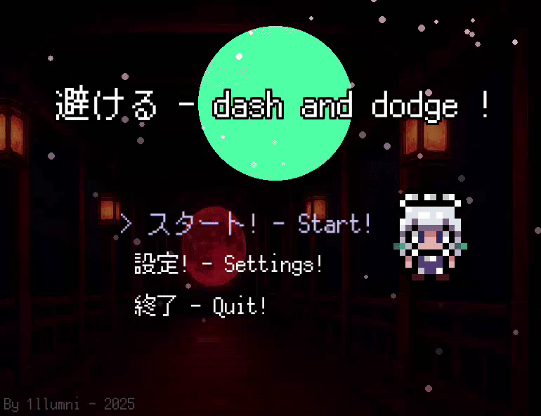
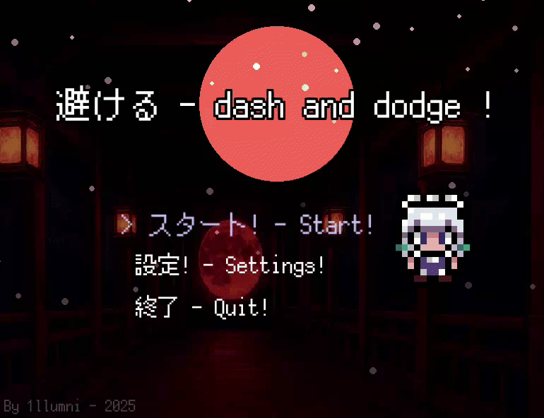

#### Dash N Dodge - Portable Game Version
---
> [! VERSION: 0.0.4]
---

## This folder contains the portable version of your game.

# CONTENTS:
- 1. DashNdodge_Linux: The game executable for Linux.
- 2. DashNdodge_Windows.exe: The game executable for Windows.
- 3. fonts/ & sprites/: Asset folders (included as backup/reference).

# HOW TO RUN (Linux):
- Double-click 'DashNdodge_Linux' or run it from the terminal: ./DashNdodge_Linux

# HOW TO RUN (Windows):
- Double-click 'DashNdodge_Windows.exe'.

> UPDATE! :
> visual effects and tweaks and animations added!
> pause menu added!
> settings menu added!
> parry system added!
> better optimization!
> bug fixes!
> new sound effects added!
> new music added!

# PREVIEWS:

